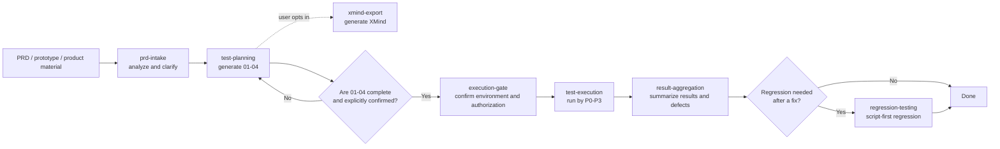

# Easy PRD Testing

[中文](README.md) | [English](README.en.md)

Easy PRD Testing is a suite of PRD / prototype-driven automation testing skills for AI coding tools. It connects product material intake, requirement clarification, test planning, execution confirmation, automated verification, evidence and defect aggregation, and post-fix regression into one confirmable and traceable workflow.

## When To Use It

- Generate test planning artifacts from a PRD, product specification, prototype, screenshot, or field baseline.
- Confirm the test URL, login method, account, scope, and risk authorization before execution.
- Organize automation tests by P0-P3 and preserve execution records, defects, and evidence.
- Optionally export Markdown test cases to a native XMind file for review.
- Reuse Playwright Test scripts first when verifying defect fixes.

## Main Workflow

Start a complete run from the `easy-prd-testing` parent skill. It routes work to the stage skills at the appropriate nodes:



> `02-测试用例.xmind` is an optional review view. `02-测试用例.md` always remains the single source of truth. Whether or not XMind is exported, all `01-04` artifacts must be complete and explicitly confirmed before execution.

## Let AI Install It For You

Copy the prompt that matches your current tool and give it to the AI. The installation should preserve the whole repository instead of copying only one stage skill.

### General AI Coding Tools

```text
Install and configure the complete Easy PRD Testing repository:
https://github.com/dszblackmagic/easy-prd-testing

First identify the Skill or Plugin mechanism supported by the current AI coding tool, then install the repository according to that tool's official conventions. Preserve the root SKILL.md, every stage skill under skills/, all templates, and scripts/; do not copy only one skill. If an installation with the same name already exists, ask me before replacing or migrating it. Run scripts/validate-plugin.sh after installation. If a dependency is missing, tell me how to install it but do not install it automatically. Finally, report the install location, install type, and how to start the complete testing workflow.
```

### Codex: Install As A Skill

Use this option when you want to start the complete workflow directly through `$easy-prd-testing`:

```text
$skill-installer Install easy-prd-testing from https://github.com/dszblackmagic/easy-prd-testing. Use the repository root path "." as the skill and preserve the complete structure containing the root SKILL.md, skills/, templates, and scripts/. If an installation with the same name exists, ask me before replacing it. Run scripts/validate-plugin.sh after installation. Report missing dependencies without installing them automatically. When finished, tell me the install location and confirm that I can start it with $easy-prd-testing.
```

### Codex: Install As A Plugin

Use this option when you want Codex Plugin loading for all stage skills:

```text
Install https://github.com/dszblackmagic/easy-prd-testing as a complete Codex Plugin. Preserve .codex-plugin/plugin.json, skills/, templates, and scripts/, then configure and install it according to the current Codex local Plugin and marketplace conventions. If a Plugin with the same name exists, ask me before replacing it. Run scripts/validate-plugin.sh after installation and confirm that easy-prd-testing appears in the Codex plugin list. Report missing dependencies without installing them automatically. Finally, tell me the install location and how to start the workflow.
```

### Claude Code: Install The Complete Skill Suite

```text
Install https://github.com/dszblackmagic/easy-prd-testing in the current Claude Code environment using Claude Code's currently supported Agent Skills directory and loading conventions. Install the complete repository and preserve the root SKILL.md, every stage skill under skills/, all templates, and scripts/ so the parent skill can continue to read stage instructions through their relative paths. If an older installation with the same name exists, ask me before replacing it. Run scripts/validate-plugin.sh after installation. Report missing dependencies without installing them automatically. Finally, tell me the install location and how to invoke easy-prd-testing.
```

### Other Tools With `SKILL.md` Support

Start with the “General AI Coding Tools” prompt above. Skill discovery directories, explicit invocation syntax, and script permissions vary between tools, so this README does not promise native installation on tools that have not been tested. Tools without Agent Skills support can still read this repository and follow the same workflow.

The complete workflow requires an AI coding environment that can read local files and run scripts. XMind export requires Node.js 18 or later. Missing dependencies should be reported to the user, not installed automatically.

<details>
<summary>Manual download and validation</summary>

```bash
git clone https://github.com/dszblackmagic/easy-prd-testing.git
cd easy-prd-testing
scripts/validate-plugin.sh
```

After downloading, reference the directory using the current AI tool's official conventions.

</details>

## 30-Second Quick Start

After installation, provide the PRD path and module name directly:

```text
$easy-prd-testing Use /path/to/order-management-prd.md to generate an automation test plan for the Order Management module. Use /path/to/output as the output root, and confirm the test environment, account, and execution scope with me step by step before execution.
```

You can also attach prototype screenshots, product notes, existing test cases, or a field baseline. The skill clarifies ambiguous content before planning and execution preparation.

### Common Prompt Templates

Complete workflow:

```text
Use easy-prd-testing to plan and execute automated tests for <module name> from <PRD or prototype path>. Write artifacts under <output root>, and confirm every execution gate with me step by step.
```

Planning only:

```text
Use the test-planning stage of easy-prd-testing to generate the 01-04 planning artifacts for <module name> from the confirmed requirements. Use <output root> as the output root and do not execute tests yet.
```

Standalone XMind export:

```text
Use the xmind-export stage of easy-prd-testing to convert <test-case Markdown file or module directory> to a native XMind file without changing the source Markdown.
```

Post-fix regression:

```text
Use the regression-testing stage of easy-prd-testing to run regression for <defect ID, test-case ID, or priority scope>, then update the matching regression records and defect status.
```

## When Each Skill Is Used

| Skill | Workflow node | Routing | Primary result |
| --- | --- | --- | --- |
| `easy-prd-testing` | When work should run from material intake through execution, aggregation, or regression | Default entry for the complete workflow | Stage routing and visible task progress |
| `prd-intake` | When a PRD, prototype, screenshot, or product note first arrives | Automatic in the complete workflow; can analyze independently | Module scope, key flows, and clarification conclusions; `00-资料分析与待确认问题.md` when its prerequisites are met |
| `test-planning` | After requirement scope and output location are confirmed | Automatic in the complete workflow; can generate planning only | `01-模块拆解.md` through `04-测试数据与账号.md` |
| `xmind-export` | After cases exist and an XMind review view is wanted | Optional in the complete workflow; can run independently | Native `.xmind` beside the source Markdown |
| `execution-gate` | After `01-04` are complete and explicitly confirmed | Required node in every execution workflow | Environment, account, scope, mutation, and risk authorization |
| `test-execution` | After every execution gate passes | Automatic in the complete workflow | P0-P3 execution records, defects, and evidence |
| `result-aggregation` | After priority-based execution finishes | Automatic in the complete workflow | Root execution and defect summaries |
| `regression-testing` | After a defect is fixed and the regression scope is known | Independent, on-demand entry | Regression records and defect status updates |

The invocation rule is simple: use `easy-prd-testing` for a complete test workflow and name a stage only for independent requirement analysis, planning, XMind export, or regression. If the selected install type exposes stage skills individually, invoke one directly; otherwise invoke the parent skill and name the stage in the prompt.

## What Happens At Each Stage

### 1. Analyze And Clarify Product Material

`prd-intake` identifies module scope, key flows, fields, permissions, states, and exception scenarios from PRDs, prototypes, product notes, or existing test materials, then confirms ambiguous items one by one.

### 2. Generate Test Planning Artifacts

After the module name and output root are confirmed, `test-planning` generates `01-04` under the fixed directory:

```text
<output-root>/easy-prd-testing/testing/<module-name>/
```

The user can then opt into `xmind-export` for a native XMind review view. Skipping or failing XMind export does not change the execution confirmation requirements for `01-04`.

### 3. Confirm Execution Conditions

After the user explicitly confirms `01-04`, `execution-gate` confirms the test URL, login mode, test account, data preparation, execution scope, priority, mutation permission, and authorization for high-risk actions. Execution does not begin while required information is missing.

### 4. Execute And Preserve Evidence

`test-execution` supports a single agent or P0-P3 priority-based execution while keeping visible task progress up to date. Execution records, defects, screenshots, videos, and scripts are written to their matching priority directories.

### 5. Aggregate Test Results

`result-aggregation` consolidates pass results, blockers, defects, and evidence indexes from every priority into a module-level conclusion.

### 6. Regress After Defect Fixes

Once the regression target is known, `regression-testing` reuses existing Playwright Test scripts first, then updates regression records and defect statuses. See [`docs/agent-protocol.md`](docs/agent-protocol.md) for the detailed execution and diagnostic escalation rules.

## Artifacts, Gates, And References

All standard testing artifacts live under:

```text
<output-root>/easy-prd-testing/testing/<module-name>/
├── 01-模块拆解.md
├── 02-测试用例.md
├── 02-测试用例.xmind          # optional; not an execution gate
├── 03-执行清单.md
├── 04-测试数据与账号.md
└── 执行结果/
    ├── P0/
    ├── P1/
    ├── P2/
    └── P3/
```

Two layers of confirmation are required before execution: the `01-04` artifacts must be complete and explicitly confirmed by the user; the test environment, account, scope, and risk authorization must also be confirmed. Standalone `xmind-export` usage is not restricted to the standard artifact directory.

More details:

- [`docs/workflow.md`](docs/workflow.md): complete stage flow, execution gates, and task progress rules.
- [`docs/artifact-contract.md`](docs/artifact-contract.md): planning documents, evidence directories, and regression artifact contracts.
- [`docs/agent-protocol.md`](docs/agent-protocol.md): single-agent, multi-agent, browser execution, and diagnostic escalation rules.

## License

MIT

## Thanks And Participation

Thank you for trying Easy PRD Testing. If the workflow helps you, consider giving the project a [Star](https://github.com/dszblackmagic/easy-prd-testing).

If you encounter a problem or have an improvement idea, please open a [GitHub Issue](https://github.com/dszblackmagic/easy-prd-testing/issues). Feedback is especially welcome on:

- Installation and invocation compatibility across AI coding tools.
- Missing or awkward steps between PRD intake and test execution.
- Testing artifacts, execution gates, and multi-agent collaboration.
- Markdown test cases and XMind export results.

Every report from real-world usage helps make this skill suite more reliable and easier to use.
